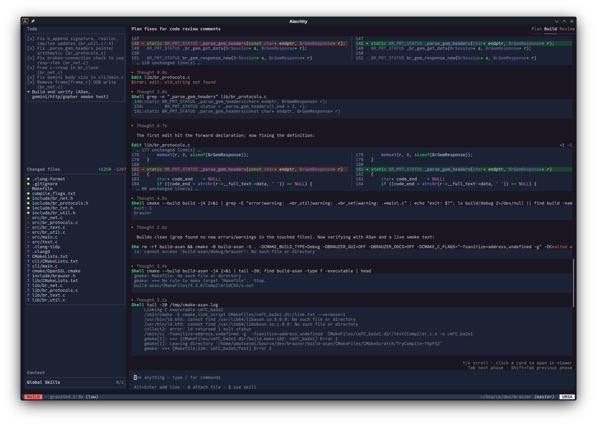
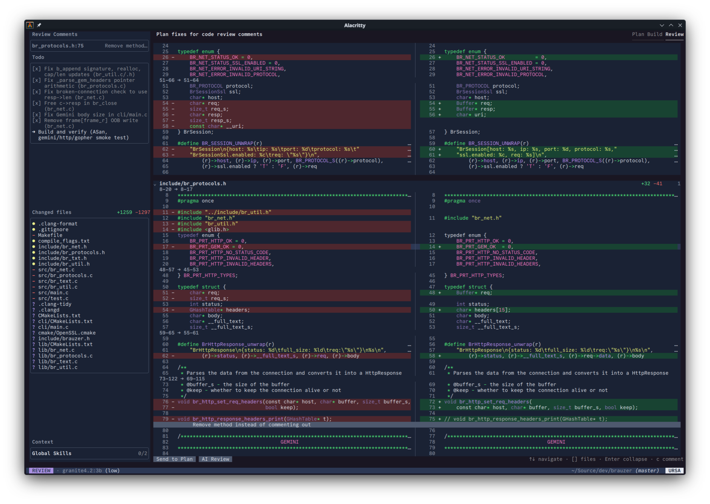

# Ursa

Ursa is a native C++ coding agent built around a small core, lazy-loaded 
capabilities, and cheap process isolation.

**\~4 MB binary · \~8 MB idle RAM · \~20–40 MB during typical agentic work**

Bring your own model connection, open Ursa in a project, and describe the 
outcome you want. Ursa reads the project instructions, gathers context, asks 
for questions when needed, and works through the task with visible reasoning, 
tool calls, diffs, and approval prompts.

> Ursa is not lightweight because it does less.
> It is lightweight because it was designed that way.



## Why Ursa?

Ursa organizes development around three modes.

**Plan:** inspect the project, gather context, ask questions, and design an 
implementation without modifying files.

**Build:** edit files, run commands, manage tasks, and delegate work to concurrent 
subagents.

**Review:** inspect the resulting Git diff, generate or manually add review 
comments, then send the findings directly back to Plan mode.

**Plan → Build → Review → Plan → Build**

## Highlights
- Native terminal UI
- Visible reasoning, tool calls, diffs, token usage, and cost
- Approval controls for mutating actions
- Up to five concurrent research or build subagents
- Separate persistent transcript for every subagent
- Different models and reasoning variants by agent role
- Automatic context compaction without removing visible chat history
- Local persistent sessions
- Project and global skills
- OpenAI-compatible, Anthropic Messages, and local model APIs
- Lazy-loaded subsystems that consume resources only when needed
- AGENTS.md, CLAUDE.md, and GEMINI.md support



## Bring Your Own Model
Ursa is provider-independent.

Use your own API connection, a subscription-backed connection where supported, 
or a locally hosted OpenAI-compatible model.

## Capabilities

- [X] Streaming Markdown and reasoning
- [X] File reading, editing, and shell commands
- [X] Interactive diffs
- [X] Plan, Build, and Review modes
- [X] Generated and manual review comments
- [X] Review → Plan handoff
- [X] Tool approval flows
- [X] Structured questions
- [X] Task tracking
- [X] Concurrent subagents
- [X] Persistent subagent transcripts
- [X] Skills and project instructions
- [X] @path file attachments
- [X] $skill attachments
- [X] Prompt queueing and generation interruption
- [X] Automatic context compaction
- [X] Persistent local sessions
- [X] Repository, context, token, and cost information
- [X] OpenAI-compatible APIs
- [X] Anthropic Messages API
- [X] Local OpenAI-compatible servers
- [X] Web search, fetch
- [X] Subagent configuration
- [X] Syntax Highlighting
### To Do
- [ ] MCP
- [ ] LSP integration
- [ ] Image or other multimodal prompt attachments
- [ ] Better Permission System
- [ ] Mid session directory change
- [ ] Usage analytics UI (Monthly)
- [ ] Capabilities system (Exposing preconfigured Python based extensions as tools)
- [ ] Headless mode
- [ ] Notifications

## Build

Ursa requires a C++23 compiler, CMake, Python 3, and CURL.
```sh
git submodule update --init --recursive
cmake -B build -DCMAKE_BUILD_TYPE=Debug -DTESTS=ON \
  -DCMAKE_EXPORT_COMPILE_COMMANDS=ON
cmake --build build --target ursa ursa_tests
./build/debug/ursa_tests
```

Start Ursa from the repository you want it to work in:

```sh
./build/debug/ursa
```

On first launch, open `/connect` to add a provider, then use `/model` to choose
a model. Type `/` in the chat input to browse the available commands.

## Commands

| Command | Purpose |
| --- | --- |
| `/new` | Save the current session and start another |
| `/connect` | Add and manage provider connections |
| `/model` | Select the active model |
| `/variant` | Select the reasoning effort |
| `/subagents` | Configure models for delegated roles |
| `/sessions` | Load or delete saved sessions |
| `/skills` | Manage discovered skills |
| `/prompt` | Inspect the generated system prompt |
| `/exit` | Save and quit |

## Local data

Ursa stores `ursa/config.json` in the platform configuration directory:

- Linux: `$XDG_CONFIG_HOME/ursa/config.json`, or
  `$HOME/.config/ursa/config.json`
- macOS: `$HOME/Library/Application Support/ursa/config.json`
- Windows: `%APPDATA%\ursa\config.json`

Saved sessions use the platform data directory:

- Linux: `$XDG_DATA_HOME/ursa`, or `$HOME/.local/share/ursa`
- macOS: `$HOME/Library/Application Support/ursa`
- Windows: `%APPDATA%\ursa`

Provider credentials are currently stored as plain JSON. Protect the config
file with user-only filesystem permissions.
